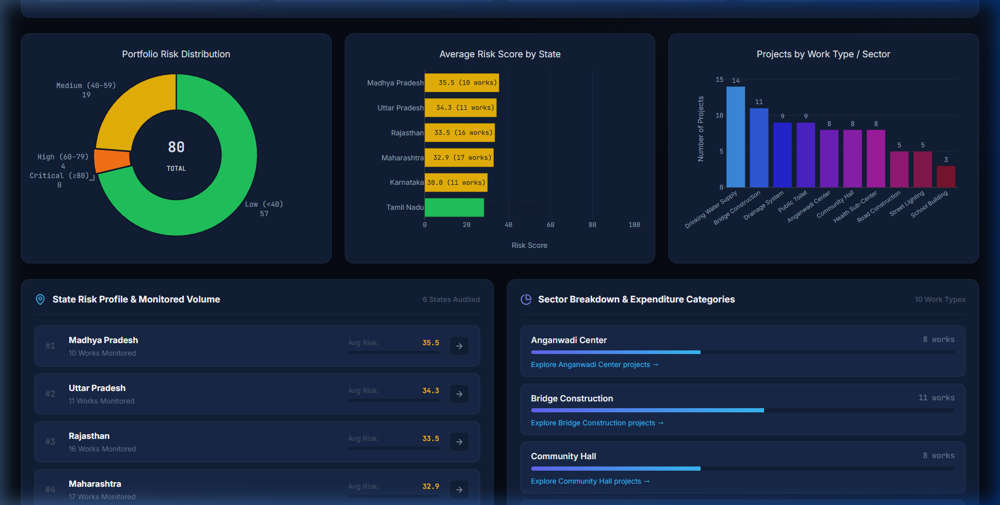

# Mantri Drishti

> **AI Flags. AI Explains. Humans Verify.**

An AI-powered risk intelligence platform for MPLADS (Member of Parliament Local Area Development Scheme) projects.


| Field | Details |
|---|---|
| **Hackathon** | Smart India Hackathon 2026 |
| **Problem Statement ID** | 26102 |
| **Problem Statement Title** | Development of an AI-powered system to detect anomalies, fraud, and inefficiencies in MPLAD Scheme implementation regd. |
| **Theme** | Smart Automation |
| **Category** | Software |
| **Team Name** | NoMoreCode |

---

## What It Does

Mantri Drishti scores every MPLADS project for financial mismatches, timeline delays, statistical anomalies, and overlap with other works, then ranks the projects so auditors can decide which ones to verify in the field first. Each score comes with a confidence value and a plain-English list of the reasons behind it. Any flagged project can be opened as an investigation dossier with its evidence, a peer comparison, and recommended verification steps.

The scores are risk signals, not findings of fraud. Every dossier carries a statutory disclaimer saying so.

It is built for district administration, vigilance and audit officers, and central or state oversight officials who monitor how MPLADS projects are executed.

The dataset that ships with the repository is synthetic: 80 projects across six states (Rajasthan, Maharashtra, Uttar Pradesh, Tamil Nadu, Karnataka, Madhya Pradesh) and 10 work types, with anomalies planted on purpose so the engines have something to find.

### Key Capabilities

- **Multi-engine risk fusion.** Four independent engines are combined into one calibrated Risk Score from 0 to 100.
- **Explained flags.** Each flag lists the specific reasons behind it ("Why Flagged"), so no score is an unexplained alarm.
- **Confidence scoring.** A 0 to 100 value based on data completeness and agreement between engines tells auditors how far to trust each flag.
- **Investigation dossiers.** Structured audit reports with evidence, peer comparison, verification steps, and the statutory disclaimer.
- **Interactive dashboard.** A React frontend with a ranked project table, Plotly charts, a Leaflet risk map, and a drill-down investigation drawer.

---

## Screenshots

### Projects: triage and ranked explorer


### Analytics: interactive Plotly charts


### Investigation drawer: project intelligence


### GIS risk map: geospatial analysis


---

## Architecture

```
mantri-drishti/
|-- backend/                     # FastAPI + Python
|   |-- app/
|   |   |-- api/                 # REST endpoints (projects.py, risk.py)
|   |   |-- core/                # Configuration & thresholds (config.py)
|   |   |-- db/                  # SQLAlchemy ORM models + SQLite setup
|   |   |-- schemas/             # Pydantic request/response schemas
|   |   \-- services/            # Business logic & intelligence engines
|   |       |-- anomaly_detection.py   # Rule Engine (6 rules) + Isolation Forest
|   |       |-- similarity.py          # TF-IDF + Haversine multi-signal overlap
|   |       |-- dossier.py             # IQR-based peer benchmarking
|   |       |-- risk_engine.py         # Orchestrator + fusion + confidence
|   |       \-- project_service.py     # CSV ingestion + fingerprint computation
|   |-- data/
|   |   \-- sample_projects.csv  # 80 synthetic projects (6 states, 10 work types)
|   |-- generate_data.py         # Synthetic dataset generator with planted anomalies
|   |-- seed.py                  # Full pipeline runner (ingest -> analyze -> persist)
|   |-- requirements.txt
|   \-- mantri_drishti.db        # SQLite database (generated)
|
\-- frontend/                    # React + Vite + TypeScript
    \-- src/
        |-- components/          # UI components (Header, ProjectTable, DossierModal, etc.)
        |-- services/            # API client + mock data fallback
        |-- styles/              # Vanilla CSS design system
        \-- types/               # TypeScript type definitions
```

---

## Scoring

### The four engines

| Engine | Weight | Method | What it detects |
|---|---|---|---|
| **Rule Engine** | 35% | Six deterministic threshold rules | Spending well ahead of progress, a large gap between actual and expected progress, delay past the expected completion date, expenditure above the sanctioned amount, reported progress far ahead of funds released, and near-zero progress after a long elapsed time |
| **Isolation Forest** | 30% | Unsupervised ML (scikit-learn, 100 trees, 10% contamination) | Statistical outliers across eight financial, progress, and timeline features |
| **Similarity Engine** | 15% | TF-IDF text similarity, Haversine distance, amount closeness, overlapping execution windows, same work type, same agency, same contractor | Duplicate or overlapping works. A pair is reported only when at least three signals agree |
| **Peer Benchmark** | 20% | IQR statistics against a peer cohort | Projects outside the 1.5 × IQR fences of comparable peers |

Peers are selected by work type first. The cohort is then narrowed to projects with a sanctioned amount between 0.5× and 2× of the target, and then to the same state, with each narrowing applied only if at least three peers remain.

### Risk Score and Confidence Score

**Risk Score** = 0.35 × Rules + 0.30 × IF + 0.15 × Similarity + 0.20 × Peer, on a 0 to 100 scale. Each engine is itself scored from 0 to 100.

**Confidence Score** is also 0 to 100:

- Up to 50 points for data completeness (how many of the expected fields are present).
- Up to 50 points for agreement between engines and financial consistency, reduced when the engine scores diverge widely.

The dashboard groups Risk Scores into four bands:

| Band | Score |
|---|---|
| Low | 0 to 39 |
| Medium | 40 to 59 |
| High | 60 to 79 |
| Critical | 80 to 100 |

The engine weights and rule thresholds are defined in `backend/app/core/config.py`. Override any of them with an environment variable prefixed `MD_` (for example, `MD_WEIGHT_RULES`).

---

## API Endpoints

| Method | Endpoint | Description |
|---|---|---|
| `GET` | `/` | Health check |
| `GET` | `/overview` | Dashboard statistics (risk distribution, top states, work types) |
| `GET` | `/projects` | Ranked project list. Filters: `state`, `district`, `constituency`, `work_type`, `risk_min`, `risk_max`. Sort with `sort_by` (`risk`, `project_id`, `district`); page with `limit` and `offset` |
| `GET` | `/projects/{id}` | Full project detail with fingerprint features |
| `GET` | `/projects/{id}/fingerprint` | Five-dimension behavioral fingerprint |
| `GET` | `/projects/{id}/risk` | Risk score breakdown by engine, plus "Why Flagged" |
| `GET` | `/projects/{id}/dossier` | Full investigation dossier with evidence and verification steps |

---

## Quick Start

### Prerequisites

- Python 3.10+
- Node.js 18+

### 1. Backend

```bash
cd backend

# Create virtual environment
python -m venv .venv
.venv\Scripts\activate        # Windows
# source .venv/bin/activate   # macOS/Linux

# Install dependencies
pip install -r requirements.txt

# Generate synthetic data + seed database + run intelligence engines
python generate_data.py
python seed.py

# Start the API server
uvicorn app.main:app --reload
```

The backend runs at **http://127.0.0.1:8000**.
- Swagger UI: http://127.0.0.1:8000/docs
- ReDoc: http://127.0.0.1:8000/redoc

### 2. Frontend

```bash
cd frontend

# Install dependencies
npm install

# Start the dev server
npm run dev
```

The frontend runs at **http://localhost:5173**.

> **Note:** If the backend is offline, the frontend automatically switches to a demonstration mode with built-in sample data.

---

## Fingerprint Features

Every project is profiled across five dimensions. Eight features are computed from the raw record. The geographic and entity fields are taken as recorded.

| Dimension | Features |
|---|---|
| **Financial** | `expenditure_ratio`, `release_ratio`, `spending_velocity` |
| **Progress** | `expected_progress`, `progress_gap` |
| **Temporal** | `planned_duration_days`, `elapsed_days`, `delay_days` |
| **Geographic** | `latitude`, `longitude` |
| **Entity** | `agency`, `contractor` |

---

## Sample Dossier Output (MD001)

```
Risk:       57.0 / 100
Confidence: 95.0 / 100
Contractor: Apex Infra Solutions

Why Flagged:
  1. High expenditure (86.9%) vs physical progress (32.3%)
  2. Progress gap: 67.7 percentage points behind schedule
  3. Delayed 983 days past expected completion
  4. Potentially overlapping project MD047 detected

Verification:
  - Verify physical progress on site
  - Review expenditure and sanction records
  - Investigate reasons for timeline delay
  - Compare work location with related projects

Disclaimer: Risk signals for human verification. Not proof of fraud.
```

---

## Tech Stack

| Layer | Technology |
|---|---|
| **Backend** | Python 3.10+, FastAPI 0.115, SQLAlchemy 2.0, SQLite |
| **ML / Analytics** | scikit-learn (Isolation Forest), Pandas, NumPy |
| **Frontend** | React 19, TypeScript 6, Vite 8, Plotly.js |
| **Maps** | Leaflet, React-Leaflet |
| **Styling** | Vanilla CSS (dark glass-morphism design system) |
| **Icons** | Lucide React |

---

## Statutory Disclaimer

> This platform identifies statistical risk signals for authorised human verification. It does not establish fraud or misconduct. All analysis results must be verified through proper institutional field inspection protocols.

---

## License

MIT
